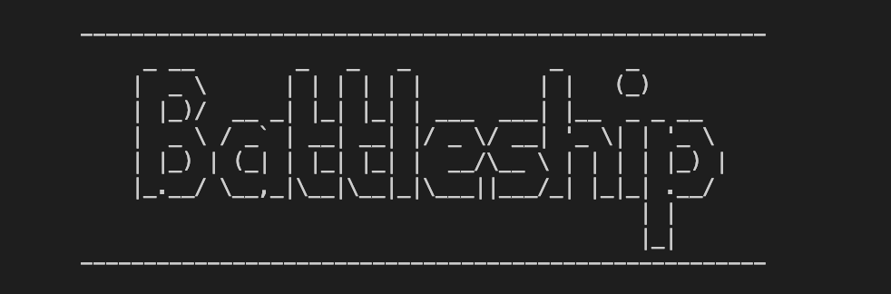
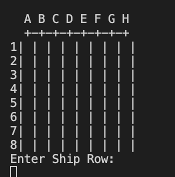

# BATTLESHIP 

My Python site is based off of the classic boardgame of the same name. In my game, the user's computer randomly places 5 ships across the grid. The user must try and locate each ship, before they run out of guesses. 

## How to play the game
1. Your computer will randomly generate 5 Battleships, across the grid.

2. You will have 30 guesses per game.

3. The player must select a row (1, 2, 3...), and then a column (A, B, C...), in order to guess the coordinates.

4. The player must try and sink the entire fleet, before they run out of guesses.

5. Sunken ships are marked with an "X."

6. Missed ships are marked with a "0."

## User Experience (UX)

I wanted the game to be both easy to navigate through, and easy to play. 

I wanted the instructions to be easy to read and learn. 

I wanted the user to have enough opportunities to guess the ships coordinates. I rounded it down to a total of 30 guesses, as being the best option for this.

I tested the game out with family and friends. They were succesful in winning the game. 

Those that didn't win the game, wanted to replay the game and try again. I was happpy with this, as I wanted for people to want to replay the game after completion. 

## Colour scheme and design 

The game is very minimalistic in style. The colour scheme is simple black and white. I wanted to include some 'Text-Art' of the game's logo, that matched the game's retro/arcade aesthetic. 

Game Logo:

Game Grid Layout:

## Technologies Used

[Python](https://www.python.org/), was used to code the game.
[Heroku](https://dashboard.heroku.com/apps), was used to deploy the game.
[Gitpod](https://gitpod.io/), was used to edit the game. 
[Github](https://github.com/), was used to host the game's content. 

## Unsolved Bugs and Validation 

There were no unsolved bugs in my project. I validated my code using [ExtendClass' Python syntax checker](https://extendsclass.com/python-tester.html). Below is the result.  

## Testing 

I tested the website on Google Chrome, Safari and Firefox. There were no issues on these browsers. 

I also tested my website using the Lighthouse validator. This was the result. 

## Deployment 

The deployment of Python sites has much more steps than that of HTML and Javascript. I followed the following steps in deploying my project. 

1. Navigate to 'Settings' in the Heroku repository. 
2. Navigate to the 'Buildpacks' section.
3. Once there, add the 'Python' and 'NodeJS' packs, precisely in that order. 
4. Connect your Github account with Heroku and search for your Github repository name. 
5. You can either auto-deploy or manually deploy your site. 
6. If these steps are followed correctly, your site should deploy with no issues. 

The live link to my website can be found here: [Battleship](https://battleshipgame-90a27c74052e.herokuapp.com/).

## Credits 

The coding for this website was inspired by the follwing [YouTube Tutorial](https://www.youtube.com/watch?v=alJH_c9t4zw).
The 'Text-Art' for the game's logo, was inspired from an example, from [ASCII Art](https://ascii.co.uk/art/battleship).